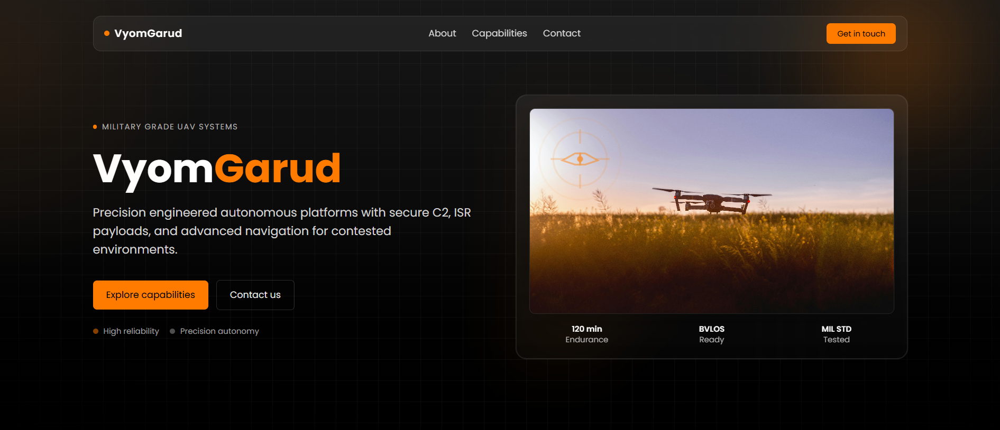
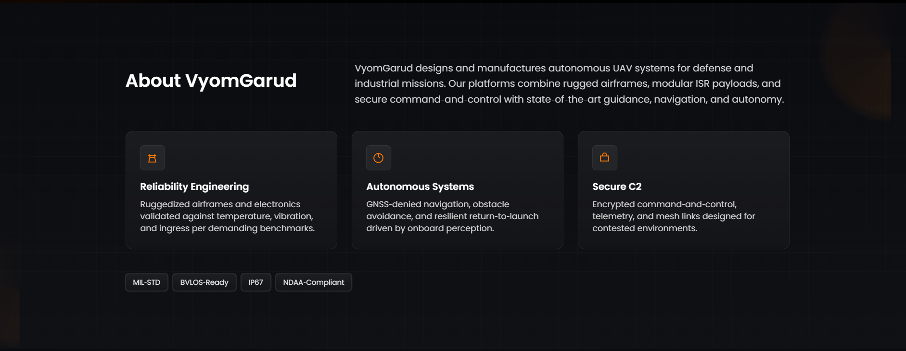
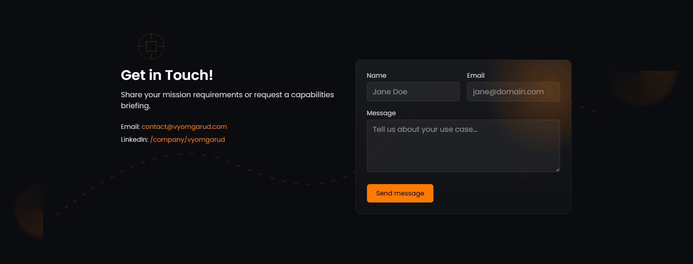

# VyomGarud – UAV Systems Landing Page

A modern, responsive single‑page site for VyomGarud, a military‑grade UAV systems company. Built with React + Vite, Tailwind CSS v4, and Framer Motion.

## Tech Stack
- React 19 (Vite)
- Tailwind CSS v4 (@tailwindcss/vite)
- Framer Motion for subtle animations
- Google Fonts: Poppins, Inter, Montserrat

## Features
- Dark, modern, slightly futuristic design with orange accent (#ff7b00)
- Sections: Hero, About, Capabilities, Highlights, Contact, Footer
- Subtle entrance animations and glass/radar‑grid styling
- Fully responsive (mobile → desktop)

## Visual Preview
Below are inline assets pulled directly from the `public/` directory (development images):

### Hero


### About


### Contact 



## Getting Started

1) Install dependencies (already present in package-lock.json):

```cmd
npm install
```

2) Start the dev server:

```cmd
npm run dev
```

3) Build for production:

```cmd
npm run build
```

4) Preview the production build:

```cmd
npm run preview
```

## Project Structure
- `src/components/` – Reusable sections (Hero, About, Capabilities, Highlights, Contact, Footer)
- `src/index.css` – Tailwind import + small brand utilities (grid, glass, fade‑up)
- `index.html` – Meta tags + Google Fonts

## Design Notes
- Aesthetic: confident, clean, persuasive; emphasizes reliability and precision
- Color palette: charcoal/black background, white/neutral text, brand orange (#ff7b00)
- Typography: Poppins (primary), Inter/Montserrat fallbacks
- Motion: short fade/slide‑up transitions; avoids distracting animations

## Screenshots / GIF
- Add screenshots to a `/docs` folder and link them here:
	- `/docs/hero.png`
	- `/docs/mobile.png`
	- `/docs/demo.gif`

## Deployment
You can deploy the `dist/` folder to any static host (Netlify, Vercel, GitHub Pages).

## License
© VyomGarud. All rights reserved.
